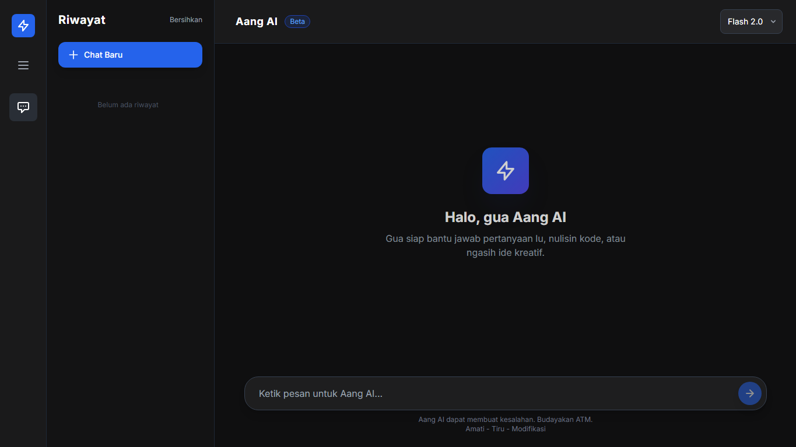

# Aang AI

Chatbot berbasis Google AI yang bisa diajak ngobrol santai, curhat, tanya-tanya, atau minta bantuan coding. Dibuat dengan bahasa Indonesia casual ala anak Jaksel.



## Fitur

- **Bahasa Indonesia Gaul**: Cocok untuk eksperimen chatbot yang lebih natural dan santai
- **Multi-fungsi**: Chat bot curhat, tanya jawab, generator kode, dan brainstorming ide kreatif
- **Riwayat Chat**: Menyimpan percakapan dalam sesi
- **Interface Clean**: Tampilan simple, user-friendly, dan responsive
- **Ganti Model**: Switch antar model AI sesuai kebutuhan

## Teknologi

- Laravel 10
- TailwindCSS
- JavaScript
- Google AI API

## Instalasi

### 1. Clone Repository

```bash
git clone https://github.com/aangbaejuri/aang-ai.git
cd aang-ai
```

### 2. Install Dependencies

```bash
composer install
npm install
```

### 3. Konfigurasi Environment

```bash
cp .env.example .env
php artisan key:generate
```

### 4. Integrasi Google AI

1. Buka [Google AI Studio](https://aistudio.google.com)
2. Login dengan akun Google
3. Buat API Key baru
4. Copy API Key yang didapat
5. Buka file `.env` di root project
6. Isi `GOOGLE_API_KEY` dengan API Key Anda:

```env
GOOGLE_API_KEY=isi_dengan_api_key_anda
```

### 5. Build Assets

```bash
npm run build
```

Untuk development dengan hot reload:

```bash
npm run dev
```

### 6. Jalankan Server

```bash
php artisan serve
```

Aplikasi akan berjalan di `http://localhost:8000`

## Penggunaan

1. Buka aplikasi di browser
2. Pilih model AI yang ingin digunakan (Flash 2.0, Flash 2.5, atau Pro 2.5)
3. Ketik pesan di input box
4. Tekan enter atau klik tombol kirim
5. Chat history akan tersimpan selama sesi aktif

## License

Open-sourced software licensed under the [MIT license](https://opensource.org/licenses/MIT).
